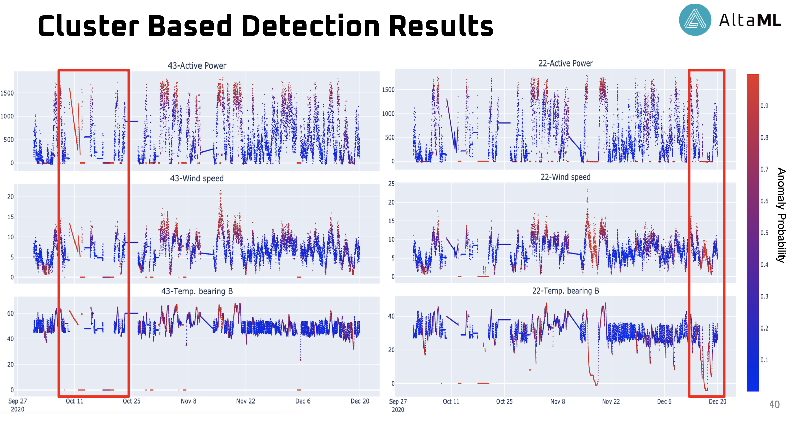
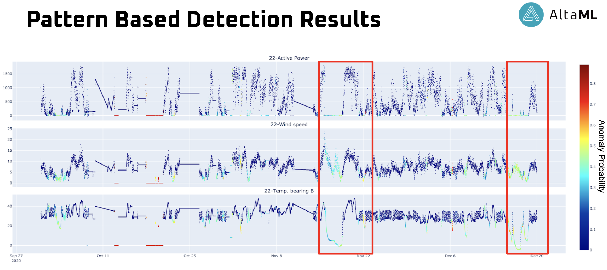

<<<<<<< HEAD
# AnomalyDetection_TA
=======
# Anomaly Detection with Semi Supervised Machine Learning Models
> Predicting anomaly probabilities for Wind Turbine data using cluster and pattern based semi supervised models.

## Description

> Cluster and Pattern based models are used to detect anomalies in time series data from sensors. Being able to detect 
anomalous trends and behaviours will help operators to identify problems early on that will reduce maintenance costs and 
extend turbine life.
> 
## Limitations
> Column names in the csv files have to be same as indicated the original csv files. Column order is not relevant. 
> Average active power columns are not needed, and if provided it will be removed automatically. 

## Datasets needed

>The dataset used in this project are uploaded to Azure Blob Storage and listed as follows:
- Melancthon Wind Turbine time series data from 9 turbines with 44 features each.


## Installation

> The pipeline for this project is built on Microsoft Azure Machine Learning. To run the code in this project;
> Upload the csv file to Azure Blob, and note its SUBSCRIPTION_ID, RESOURCE_GROUP, WORKSPACE_NAME, DATASET_NAME.

> Steps to install required packages:
1. Create a virtual environment on the azure compute instance terminal.
2. Clone this repository to your compute and install the requirements; 

    ```pip install requirements.txt ```
3. Install Anomatools package:
    
    ```pip install git+https://github.com/Vincent-Vercruyssen/anomatools.git@master```
    
    ```pip install dtaidistance```
4. Install PBAD package:
    
    - Clone the [PBAD repository](https://bitbucket.org/len_feremans/pbad/src/master/)
    - Build the code by running the setup.py file:
    
        ```cd src/utils/cython_utils/```
        
        ```python setup.py build_ext --inplace```
     - If you receive an error, run the command second time.
     - Note the location of the "src" folder, this will be required in the config file.

 
## Usage

1. Activate the virtual environment the installation was completed;
```bash
conda activate environment_name
```
 
2. Update the [data acquisition configuration](data_acquisition/data_acquisition_config.py):
   >- `SUBSCRIPTION_ID`: Set the String value you received from Azure Dataset Blob (Consume tab)
   >- `RESOURCE_GROUP`: Set the String value you received from Azure Dataset Blob (Consume tab)
   >- `WORKSPACE_NAME` : Set the String value you received from Azure Dataset Blob (Consume tab)
   >- `DATASET_NAME` : Set the String value you received from Azure Dataset Blob (Consume tab)
   
2. Update the [data processing configuration](data_processing/data_processing_config.py):
   >- `GROUP_TURBINE_NAME_LIST`: Set the list of turbine names to be extracted
   >- `EXCLUDE_FROM_MEAN_LIST`: Set the list of turbines to be excluded from mean calculation (if imputation is being done)
   >- `FEATURE_ID` : Set the feature suffix to define the imputation target (if imputation is being done)
   >- `TURBINE_NAME` : Set the turbine name to be imputed ((if imputation is being done))
   >- `MODEL_NAME`: Set the String value for the model name, either pbad or ssdo. 
   >- `LABEL_LIST`: Set the list to specify the turbine names and labels for each turbine
   
 3. Update the [model training configuration](model_training/model_training_config.py):
       >- `PBAD_SC_PATH`: Set the path for the source code of PBAD package
       >- `EXCLUDE_COLUMNS`: Set the list of columns to be excluded from the model fit. Add additional features here if you want to exclude them from your experiment
       >- `ESTIMATORS` : Set the SSDO parameter for the number of base estimators in the Isolation Forest
       
 4. Update the [eda configuration](eda/eda_config.py) used for plotting the results:
       >- `PLOT_FOLDER`: Set the path for the folder to save the plots for anomaly probabilities
       >- `COLORSCALE`: Set the colorscale for the plots. List of options can be access [here](https://plotly.com/python/builtin-colorscales/)
       >- `PLOT_OPTION` : Set the option for either save or show (show can be used in notebooks).
       >- `TURBINE_NAME`: Set the turbine name to be plotted
       >- `START_TIME` : Set the plot start time
       >- `END_TIME` : Set the plot end time
 5. To run the pipeline, type one of the following commands in Azure Machine Learning terminal in the root of the project:
    
    - For PBAD without imputation:
    ```bash
    python run_pipeline.py pbad
    ```
    
    - For PBAD with imputation:
    ```bash
    python run_pipeline.py pbad impute
    ```
    
    - For SSDO without imputation:
    ```bash
    python run_pipeline.py ssdo
    ```
    
    - For SSDO with imputation:
    ```bash
    python run_pipeline.py pbad impute
    ```
      
### Model Outputs

The model will output anomaly probability score plots as HTML files in the defined folder, one plot for each feature.

## Results

Sample results for both models ( Turbines 1528-07,1528-22, and 1528-43).


Figure 1: Results of SSDO Model 


Figure 2: Results of PBAD Model 
>>>>>>> 87f430cfe59479742c76d5fadcab58f6e6ec4c3e
# Anomaly_Detection
